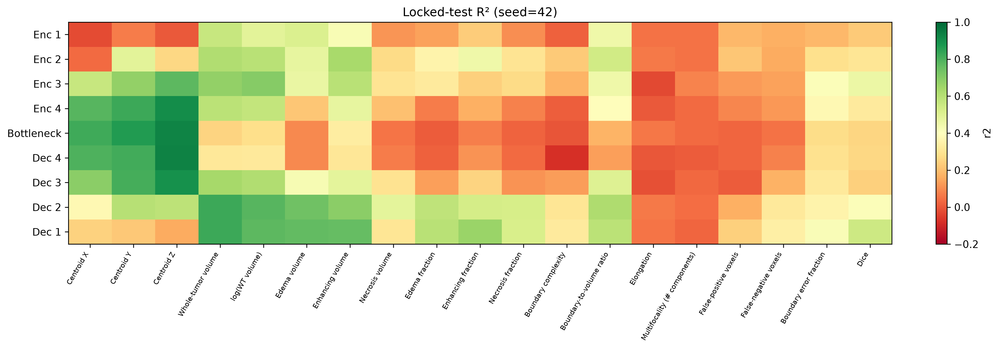
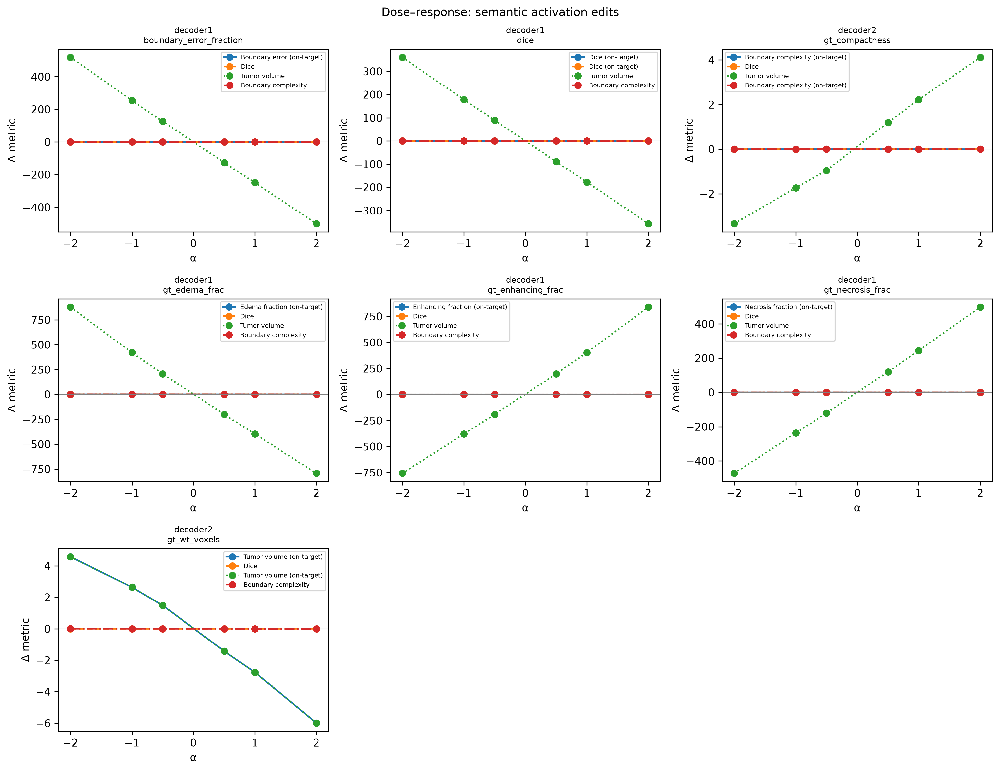
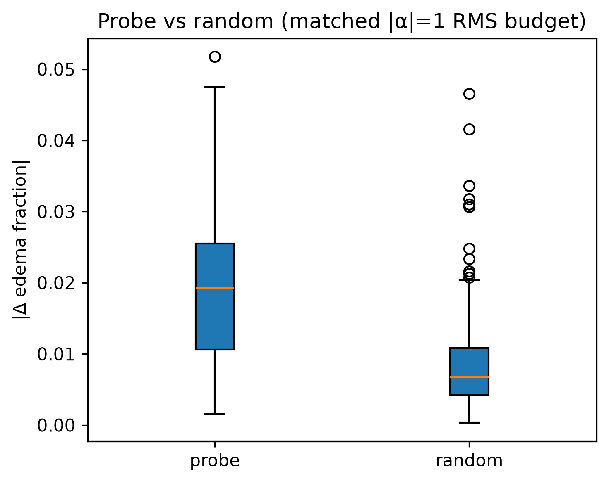
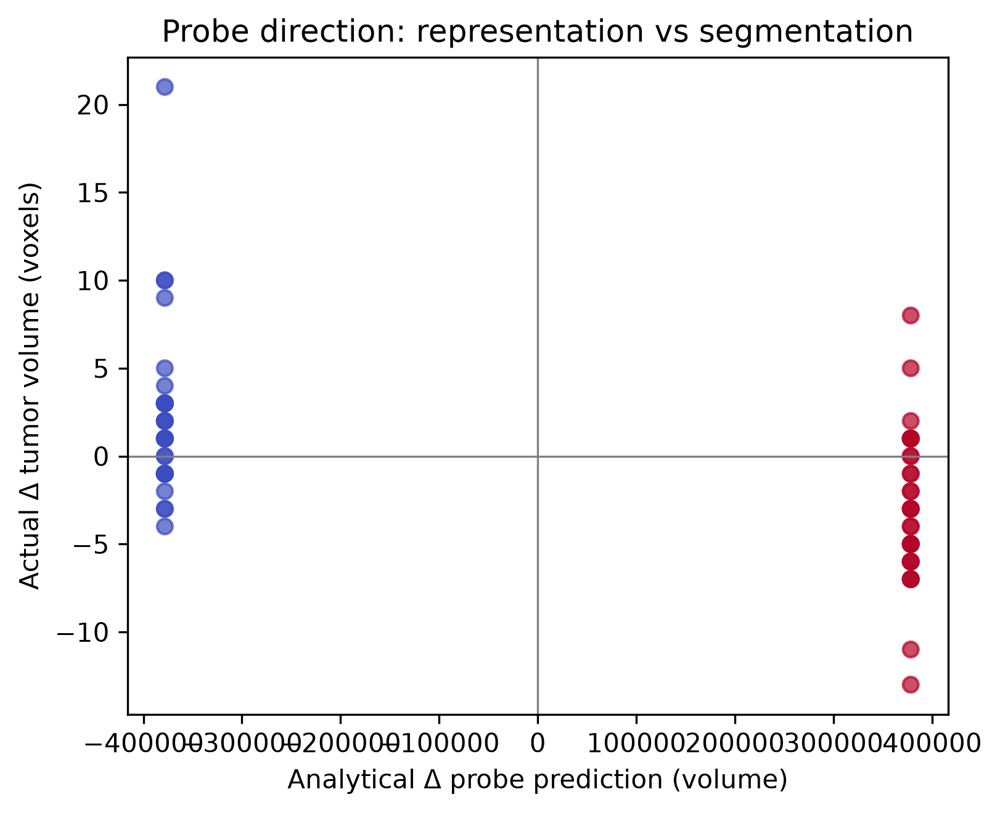

# Decodable Is Not Controllable
## Probing and Editing Anatomical Representations in a 3D U-Net

[](https://www.python.org/downloads/)
[](https://pytorch.org/)
[](https://www.synapse.org/#!Synapse:syn27046444)

**Thesis:** Late U-Net decoder representations contain linearly accessible anatomical information, but linear recoverability does not guarantee selective causal control. Probe-aligned editing weakly steers edema composition beyond matched random perturbations, whereas a highly predictive tumor-volume direction changes its analytical readout without producing probe-specific downstream volume control.

---

## Thirty-second overview

This repository documents a mechanistic case study of a trained 3D U-Net on BraTS 2021 (375 validation cases). We ask whether properties that are linearly decodable from internal activations can also be selectively manipulated by editing those activations along probe-derived directions.

The answer is mixed—and that asymmetry is the point. Edema fraction at decoder1 is weakly steerable beyond random controls. Tumor volume at decoder2 is strongly decodable (R² = 0.822) yet not steerable in a probe-specific way: matched random perturbations change segmentation volume as much as the probe direction does.

---

## Central comparison

| Result | Edema at decoder1 | Tumor volume at decoder2 |
|---|---:|---:|
| OOF Ridge probe R² | 0.596 | 0.822 |
| Probe edit effect | 2.08 percentage points | 3.82 voxels |
| Matched-random effect | 0.88 percentage points | 4.45 voxels |
| Probe/random ratio | 2.36× | 0.86× |
| Interpretation | Weak semantic steering | Decodable, not a downstream control axis |

*Probe edit effects for the comparison rows come from the 30-case matched-random screens (|α| = 1). Full-cohort editing at |α| = 1 yields mean |Δedema| ≈ 2.05 pp (375 cases; `editing_summary.csv`).*

---

## Research question

**Does linearly decodable anatomical information in a segmentation network imply that the same representation can be selectively controlled?**

We separate three forms of evidence often conflated in representation analysis:

1. **Recoverability** — Can a property be read out from activations?
2. **Functional dependence** — Does disrupting a layer damage segmentation?
3. **Controllability** — Can a targeted intervention change the corresponding output property?

---

## Why decodability ≠ controllability

A Ridge probe identifies a direction correlated with a property in representation space. Editing along that direction tests whether the network *uses* that axis for downstream control. These need not coincide: correlations can reflect encoding without providing an intervention handle the decoder exploits.

Tissue fractions are compositional (edema, enhancing, necrosis sum within tumor), so off-target coupling is expected even when on-target movement is real. Whole-layer mean ablation tests whether intact activations are needed for segmentation; it does **not** establish that any single probe direction is causally necessary.

---

## Study design

| Stage | Method | Scale |
|---|---|---|
| Linear probing | Fold-safe Ridge on global-pooled activations | 375 val cases, all encoder/decoder layers |
| Layer ablation | Replace layer activations with channel means | 375 val cases (partial log committed) |
| Representation editing | A′ = A + αΔ, Δ from probe adjoint lift | 375 val cases, multiple properties |
| Matched-random controls | Unit random directions, same \|α\| and RMS budget | 30 stratified cases per screen |

**Model:** 3D U-Net, 10-hour BraTS training run, **epoch 5** checkpoint. **Intervention:** spatially constant per-channel perturbation broadcast across the activation map.

---

## Main findings

### Probing (best layer per target, 5-fold OOF R² on 375 cases)

| Property | Layer | R² |
|---|---|---:|
| Tumor volume | decoder2 | 0.822 |
| Enhancing fraction | decoder1 | 0.647 |
| Edema fraction | decoder1 | 0.596 |
| Dice | decoder1 | 0.565 |
| Necrosis fraction | decoder1 | 0.525 |
| Boundary complexity | decoder2 | 0.430 |
| Boundary error | decoder1 | 0.415 |

*Source: `outputs_10hour/layer_analysis/layer_recoverability.csv`*

### Editing (375 cases)

- Decoder1 tissue-fraction edits were **monotonic but small** (e.g., edema Δ ≈ 2.05 pp at |α| = 1; ≈ 4.17 pp at |α| = 2).
- Edits caused **substantial off-target changes** in other tissue properties and volume.
- **Dice changes were negligible**; no evidence of segmentation repair.

### Matched-random screens (small; not significance tests)

**Edema (decoder1):** 30 cases, 3 random directions, |α| = 1. Probe mean |Δedema| = 0.0208 vs random 0.0088 (ratio 2.36). Weak target-related steering beyond a generic same-sized perturbation, but not selective control.

**Volume (decoder2):** 30 cases, 5 random directions, |α| = 1. Probe mean |Δvolume| = 3.82 voxels vs random 4.45 (ratio 0.86; 47th percentile). +α/−α flipped analytical Ridge predictions in 100% of cases but actual volume in only 57%—representation moves along the readout axis without probe-specific downstream volume control.

---

## Interpretation

The strongest volume probe in this study is among the weakest editors. Predictive probe directions may reflect naturally occurring representation correlations rather than axes the downstream network treats as control handles. Edema at decoder1 shows the opposite partial pattern: modest semantic steering beyond random, coupled across tissue properties.

This is a mechanistic readout-versus-control analysis, not a clinical correction method.

---

## Key figures

**Layer recoverability (locked holdout R²)**



**Editing dose–response**



**Edema probe vs random (30-case screen)**



**Volume: analytical probe change vs actual segmentation change**



---

## What this study establishes

- On this U-Net, late decoder layers encode anatomical properties with substantial linear recoverability.
- Probe-aligned additive edits can weakly steer some tissue-composition outputs.
- A highly predictive volume direction does not provide probe-specific downstream volume control in this setting.
- Recoverability, layer necessity (ablation), and selective controllability are distinct and can diverge.

## What this study does not establish

- Universal claims across architectures, datasets, or training regimes.
- Clinical utility, deployment readiness, or automatic segmentation repair.
- That tumor volume is uncontrollable in general—only that this probe direction at decoder2 fails the matched-random screen.
- Formal significance of the 30-case random-direction comparisons.

---

## Limitations

- Single checkpoint and additive, globally broadcast interventions.
- Tissue fractions are compositional and partially coupled.
- Random-control screens are small exploratory checks, not powered hypothesis tests.
- Whole-layer ablation is destructive and not property-specific.
- Layer ablation log in the repository covers 279/375 cases at last commit (`rho_log.csv`).
- Checkpoints, embeddings, and raw predictions are not stored in git.

---

## Manuscript status

Core experiments are complete. Manuscript construction (figures, Results, Methods) is beginning.

---

## Mentorship sought

I am seeking **scientific mentorship** (not implementation help) on:

- causal interpretation and statistical rigor;
- essential versus optional controls;
- manuscript framing and related literature;
- publication venue;
- main-paper versus supplementary analyses.

---

## Reproduction

**Prerequisites:** BraTS 2021 data, Python environment (`requirements.txt`), trained checkpoint at `outputs_10hour/checkpoints/checkpoint_latest.pt` (epoch 5; not in git).

```bash
python -m venv .venv && source .venv/bin/activate
pip install -r requirements.txt
# Set data.root in configs/ten_hour.yaml
```

**Inspect committed results** (no GPU required):

```bash
# Tables and reports under outputs_10hour/
```

**Re-run analysis** (requires local checkpoint + layer embeddings from `export_layer_embeddings.py`):

```bash
python analyze_layer_holdout_recoverability.py \
  --layer-index outputs_10hour/layer_embeddings/layer_index.csv \
  --failure-table outputs_10hour/failure_tables/failure_metrics.csv

python learn_semantic_directions.py \
  --config configs/ten_hour.yaml \
  --checkpoint outputs_10hour/checkpoints/checkpoint_latest.pt \
  --layer-index outputs_10hour/layer_embeddings/layer_index.csv \
  --failure-table outputs_10hour/failure_tables/failure_metrics.csv \
  --output-dir outputs_10hour/semantic_directions

python analyze_representation_editing.py \
  --config configs/ten_hour.yaml \
  --checkpoint outputs_10hour/checkpoints/checkpoint_latest.pt \
  --failure-table outputs_10hour/failure_tables/failure_metrics.csv \
  --directions-dir outputs_10hour/semantic_directions \
  --output-dir outputs_10hour/representation_editing

python analyze_edema_probe_screen.py \
  --config configs/ten_hour.yaml \
  --checkpoint outputs_10hour/checkpoints/checkpoint_latest.pt \
  --failure-table outputs_10hour/failure_tables/failure_metrics.csv

python analyze_volume_probe_screen.py \
  --config configs/ten_hour.yaml \
  --checkpoint outputs_10hour/checkpoints/checkpoint_latest.pt \
  --failure-table outputs_10hour/failure_tables/failure_metrics.csv \
  --n-random 5
```

Precomputed summaries: `outputs_10hour/representation_editing/`, `edema_probe_screen/`, `volume_probe_screen/`.

---

## Repository structure

```text
configs/ten_hour.yaml
analyze_layer_holdout_recoverability.py   # Probing
learn_semantic_directions.py              # Probe → edit directions
analyze_representation_editing.py         # Full editing cohort
analyze_edema_probe_screen.py           # Edema vs random (30 cases)
analyze_volume_probe_screen.py            # Volume vs random (30 cases)
analyze_layer_interventions.py            # Whole-layer ablation
export_layer_embeddings.py                # Activation export (local)
outputs_10hour/                           # Curated CSVs, figures, directions
docs/previous_work/                       # Archived uncertainty study
```

---

## Data governance and license

Code is released for research. BraTS 2021 use is subject to [Synapse terms](https://www.synapse.org/#!Synapse:syn27046444). No patient identifiers are included in committed artifacts. BraTS: Menze et al., CVPR 2015; Bakas et al., 2017–2021.

---

## Contact

**[YOUR NAME]** — [YOUR INSTITUTION]  
Email: [YOUR EMAIL]  
GitHub: [DarkPhantom738/segmentation-failure-analysis](https://github.com/DarkPhantom738/segmentation-failure-analysis)

---

## Project origins

This repository began as an investigation of whether bottleneck embeddings complement TTA uncertainty for segmentation-quality estimation without ground truth. Those experiments motivated the present mechanistic question: *what do internal representations encode, and can they be manipulated?*

The earlier uncertainty-and-geometry analysis is archived at [`docs/previous_work/uncertainty_quality_estimation.md`](docs/previous_work/uncertainty_quality_estimation.md).
