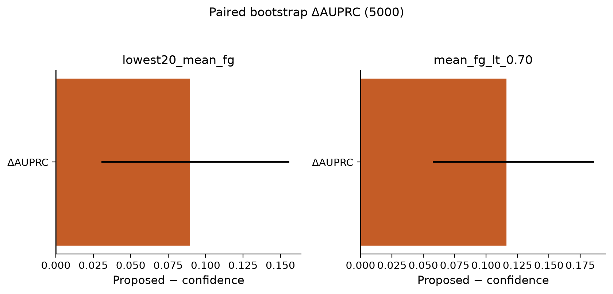
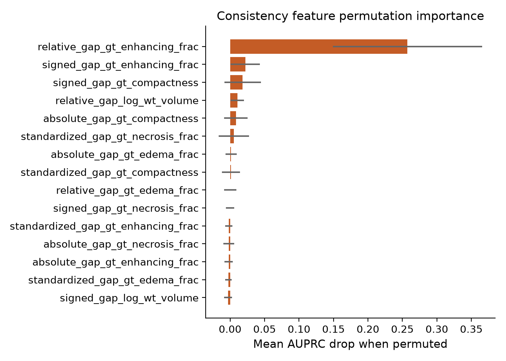
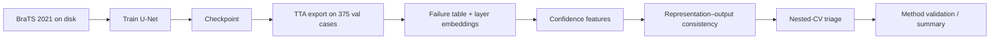

# Anatomical Representation–Output Consistency Improves Confidence-Based Failure Triage in 3D Brain Tumor Segmentation

[](https://www.python.org/downloads/)
[](https://pytorch.org/)
[](https://www.synapse.org/#!Synapse:syn27046444)

This repository contains code and committed analysis outputs for a retrospective study of failure detection in 3D brain tumor segmentation. The project uses a trained 3D U-Net on BraTS 2021 to examine whether internal anatomical representations can improve case-level quality control beyond standard inference-time confidence.

The main contribution is a confidence-augmented representation–output consistency method. For each case, the method compares anatomical properties estimated from hidden representations with the same properties measured from the predicted segmentation mask. The resulting discrepancy features are combined with confidence summaries to rank cases for manual review.

The repository also includes supporting representation-analysis experiments. These evaluate whether anatomical and quality-related properties are recoverable from U-Net layers, whether segmentation depends on intact spatial activations at different stages, and whether probe-derived directions can reliably control the final segmentation.

---

## Study Scope

| Component | Purpose | Main interpretation |
|---|---|---|
| Representation recoverability | Fit linear probes to hidden activations | Tests whether anatomical or quality-related information is decodable from each layer |
| Spatial mean ablation | Replace spatial activation maps with channel means | Tests sensitivity to spatial organization at each network stage |
| Representation editing | Add probe-derived directions to activations | Tests whether decodable directions produce intended output changes |
| Failure triage | Combine confidence with representation–output discrepancies | Tests whether internal consistency improves ranking of unreliable segmentations |

The failure-triage analysis is the primary practical result. The probing, ablation, and editing analyses provide mechanistic context and are not required to run the final triage model.

Exploratory and non-primary repair experiments are documented separately under [`extra/`](extra/README.md).

---

## Primary Result

The main evaluation used the 375-case BraTS 2021 validation partition, five-outer-fold/four-inner-fold nested cross-validation, and 5000 paired bootstrap replicates. The primary failure definition was the lowest 20% of cases by mean foreground Dice.

**Detecting the lowest-quality 20% of segmentations**

| Method | AUPRC | AUROC | Capture at 20% review | Brier |
|---|---:|---:|---:|---:|
| Confidence only | 0.805 | 0.931 | 71.4% | 0.102 |
| Confidence + morphology | 0.851 | 0.954 | 75.3% | 0.077 |
| Confidence + pooled representations | 0.854 | 0.948 | 74.0% | 0.081 |
| **Confidence + representation–output consistency** | **0.895** | **0.960** | **79.2%** | **0.064** |

**Confidence + consistency vs confidence only**

| Endpoint and metric | Point change | 95% bootstrap CI | Bootstrap probability of improvement |
|---|---:|---|---:|
| Lowest 20% mean foreground Dice, AUPRC | **+0.090** | **[0.031, 0.152]** | 99.8% |
| Lowest 20% mean foreground Dice, capture at 20% review | **+7.8 percentage points** | **[+1.3, +16.5]** | 97.7% |
| Mean foreground Dice below 0.70, AUPRC | **+0.117** | **[0.056, 0.185]** | 100.0% |

For the second primary endpoint, mean foreground Dice below 0.70, AUPRC increased from 0.770 with confidence alone to 0.887 with confidence plus consistency.

These results support the use of representation–output consistency as a complement to confidence for retrospective failure triage. They do not establish clinical utility, prospective workflow benefit, or automatic segmentation repair.

Committed result tables are available in [`results/paper/triage_20260712/`](results/paper/triage_20260712/) and [`results/paper/method_validation/`](results/paper/method_validation/).

---

## Representation Analysis Findings

Internal U-Net representations contained substantial anatomical and quality-related information. Whole-tumor volume, edema fraction, enhancing-tumor fraction, necrotic/nonenhancing-tumor fraction, and Dice score were recoverable from different layers, with the most informative layer varying by target.

Spatial mean ablation showed a different pattern from linear probing. Removing spatial organization at late decoder stages, especially `decoder1`, strongly degraded segmentation performance, while the bottleneck intervention had little effect on Dice. This indicates that layer-wise recoverability and functional sensitivity are related but not interchangeable.

Probe-derived editing did not consistently translate recoverability into controllability. Edema-fraction edits produced a small output response that exceeded matched random directions in the 30-case screen. In contrast, whole-tumor volume was strongly recoverable but did not provide a reliable output-control direction. These findings motivated the use of internal representations for reliability assessment rather than direct segmentation repair.

Relevant code and summaries:

| Resource | Description |
|---|---|
| [`src/analysis/`](src/analysis/README.md) | Analysis modules for probing, consistency, triage, and validation |
| [`extra/`](extra/README.md) | Supplementary probing, editing, and repair scripts |
| [`results/paper/`](results/paper/README.md) | Committed manuscript-facing result snapshot |

---

## Method Summary

For each anatomical target, Ridge probes are fitted within the training folds to estimate a property from hidden representations. The same property is independently measured from the predicted segmentation mask. The signed, absolute, and relative differences between the representation-derived estimate and the mask-derived value form representation–output consistency features.

The final triage model combines these consistency features with inference-time confidence summaries, including maximum softmax probability, predictive entropy, top-two class margin, tumor-volume confidence, and boundary uncertainty. No ground-truth-derived feature is supplied to the failure-risk model at inference time. Reference segmentations are used only for probe fitting inside training folds, defining failure labels, and evaluating held-out predictions.

The strongest consistency signal came from enhancing-tumor fraction discrepancies. Consistency improved detection of poor overall segmentations more than edema-specific failures.

---

## Data and Model

| Item | Description |
|---|---|
| Dataset | BraTS 2021 training set |
| Split | 1,251 cases split deterministically into 876 training cases and 375 validation cases using seed 42 |
| Inputs | T1-weighted, contrast-enhanced T1-weighted, T2-weighted, and FLAIR MRI |
| Labels | Background, necrotic/nonenhancing tumor, edema, enhancing tumor |
| Model | Four-level 3D U-Net with encoder/decoder skip connections |
| Primary checkpoint | Epoch-5 checkpoint from the original 10-hour training configuration |
| Representation stages | `encoder1`–`encoder4`, `bottleneck`, `decoder4`–`decoder1` |
| Robustness track | Converged multi-seed training using `train_converged.py` and `configs/converged_unet.yaml` |

Split and environment details are documented in [`docs/manuscript/environment_and_split.md`](docs/manuscript/environment_and_split.md).

---

## Figures

**Precision–recall curves**


**Failure capture at fixed review budgets**


**Bootstrap distribution of AUPRC improvement**



**Feature permutation importance**



| File | Contents |
|---|---|
| [`results/paper/triage_20260712/aggregate_metrics.csv`](results/paper/triage_20260712/aggregate_metrics.csv) | Main nested-CV triage metrics |
| [`results/paper/method_validation/validation_summary.md`](results/paper/method_validation/validation_summary.md) | Bootstrap, ablation, and validation summary |
| [`results/paper/confidence_features.csv`](results/paper/confidence_features.csv) | Case-level confidence features |
| [`results/paper/consistency/case_level_features.csv`](results/paper/consistency/case_level_features.csv) | Case-level representation–output consistency features |

---

## Repository Guide

| Path | Role |
|---|---|
| [`docs/paper_pipeline.md`](docs/paper_pipeline.md) | End-to-end pipeline description |
| [`configs/`](configs/README.md) | Configuration files for training, inference, triage, and validation |
| [`scripts/`](scripts/README.md) | Command-line entry points |
| [`src/data/`](src/data/README.md) | BraTS loading, preprocessing, and split utilities |
| [`src/models/`](src/models/README.md) | 3D U-Net and related model components |
| [`src/training/`](src/training/README.md) | Training, inference, TTA, and convergence logic |
| [`src/analysis/`](src/analysis/README.md) | Failure labels, confidence features, consistency features, nested CV, and validation |
| [`results/paper/`](results/paper/README.md) | Committed result snapshot used for manuscript tables and figures |
| [`extra/`](extra/README.md) | Supplementary and exploratory analyses |

Large local outputs such as checkpoints, cached volumes, and full prediction arrays are intentionally excluded from version control.

---

## Train and Test Pipeline

End-to-end narrative with I/O tables: [`docs/paper_pipeline.md`](docs/paper_pipeline.md). Stage CLIs: [`scripts/README.md`](scripts/README.md).

### 0. Environment and BraTS layout

```bash
python -m venv .venv
source .venv/bin/activate
pip install -e ".[dev]"
```

Place BraTS 2021 under `data/BraTS2021_Training/` (see [`data/README.md`](data/README.md)):

```text
data/BraTS2021_Training/BraTS2021_XXXXX/
  BraTS2021_XXXXX_{t1,t1ce,t2,flair,seg}.nii.gz
```

Default split (seed 42, `val_fraction=0.30`): **876 train / 375 validation**. The 375-case set is the evaluation cohort for TTA export, failure labels, and triage.



### 1. Train

**Paper path (original 10-hour / epoch-5 setup)**

```bash
python train.py --config configs/ten_hour.yaml
```

Writes checkpoints under `outputs_10hour/`. This is the configuration behind the committed README tables (when paired with the epoch-5 analysis snapshot).

**Converged multi-seed path (robustness track)**

Uses a shared patient split; only the model seed changes. Development early-stopping lives inside the 876 train cases; the 375 final-evaluation cases stay fixed.

```bash
# all configured seeds
bash scripts/run_converged_seeds.sh

# or one seed
python train_converged.py --config configs/converged_unet.yaml --seed 123
```

Artifacts land in `outputs_converged/seed_XXX/` (checkpoint, `convergence_summary.json`).

### 2. Test / export (frozen inference on the 375-case cohort)

After training (or from an existing checkpoint), export TTA predictions and uncertainty metrics. Do **not** retarget the patient split to the model seed: pin `data_split_seed` / `final_evaluation_cases` as in the converged export configs.

```bash
# paper checkpoint → outputs_10hour/
python train.py --config configs/ten_hour.yaml --export-tta

# converged seed example (use the seed’s export YAML after path retargeting)
python train.py \
  --config outputs_converged/seed_123/analysis/configs/converged_seed123_export.yaml \
  --export-tta
```

Expected metrics file: `.../metrics_uncertainty.csv` with **375** rows on the shared final-evaluation cohort.

### 3. Downstream failure-triage analysis

**One-shot paper regeneration** (TTA → failures → embeddings → confidence → consistency → triage → validation):

```bash
bash scripts/run_paper_pipeline.sh
# if TTA artifacts already exist:
SKIP_TTA=1 bash scripts/run_paper_pipeline.sh
```

**Per converged seed** (after that seed’s TTA export):

```bash
bash scripts/run_seed_downstream.sh 123
```

Stage order inside the chain:

| Stage | What it does | Typical output |
|---|---|---|
| Failure table | Dice / failure labels from TTA masks | `failure_tables/failure_metrics.csv` |
| Layer embeddings | Pooled activations at 9 U-Net stages | `layer_embeddings/` |
| Confidence | GT-free confidence summaries (prefers saved TTA probs when configured) | `case_level_confidence_features.csv` |
| Consistency | Representation–output gap features | `consistency/` |
| Triage | Nested CV: confidence vs confidence+consistency | `confidence_consistency_triage*/` |
| Validation | Bootstrap CIs, ablations, figures | `method_validation/`, `seed_analysis_summary.md` |

Individual stages can also be run via the `scripts/run_*.py` CLIs listed in [`scripts/README.md`](scripts/README.md).

### 4. Inspect results without retraining

Committed manuscript tables and figures are under [`results/paper/`](results/paper/README.md). You can read those without BraTS volumes or GPUs. Regenerating numbers requires local data, checkpoints, and the commands above.

### 5. External cohorts (not wired yet)

Public sets such as [UCSF-PDGM](https://www.cancerimagingarchive.net/collection/ucsf-pdgm/) and [UPENN-GBM](https://www.cancerimagingarchive.net/collection/upenn-gbm/) are suitable **candidates for frozen external testing** (same four structural contrasts + BraTS-style segs), but this repo’s loader currently expects the BraTS 2021 directory naming. Using them would need an I/O adapter and **strict de-duplication** against BraTS 2021 IDs before claiming an external test.

---

## Limitations

- The study uses one public dataset and one primary U-Net architecture.
- The evaluation is retrospective and does not test a clinical workflow.
- The proposed method complements confidence; consistency features alone do not outperform confidence.
- The strongest signal comes from enhancing-tumor composition discrepancies, which may not generalize unchanged to other cohorts or models.
- Benefits are clearer for poor overall segmentation quality than for edema-specific failures.
- Risk–coverage AURC did not show a statistically supported improvement.
- Representation editing and repair experiments did not produce a reliable automatic correction method.

---

## Data Governance

BraTS 2021 is distributed under the terms specified by the dataset organizers on [Synapse](https://www.synapse.org/#!Synapse:syn27046444). This repository does not include raw imaging data, model checkpoints, cached volumes, or full prediction arrays. Committed CSV outputs use case identifiers from the analysis pipeline and do not include patient-identifying information.

Key dataset references include Menze et al. (CVPR 2015) and the BraTS challenge publications by Bakas et al. and collaborators.

No license file is currently provided.
