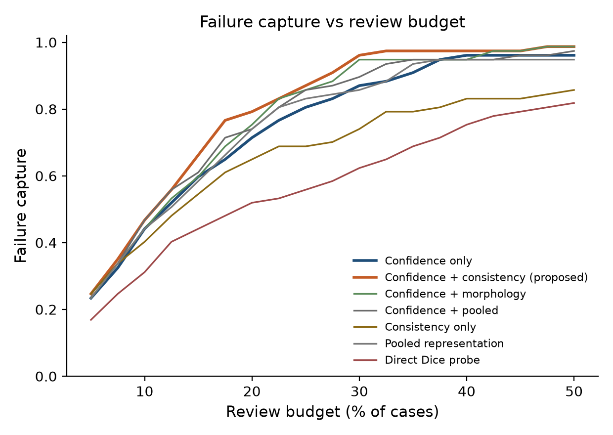

# Anatomical Representation–Output Consistency Improves Confidence-Based Failure Triage in 3D Brain Tumor Segmentation

[](https://www.python.org/downloads/)
[](https://pytorch.org/)
[](https://www.synapse.org/#!Synapse:syn27046444)

This project studies a 3D U-Net for BraTS brain-tumor segmentation. Anatomical properties are often decodable from internal activations, but probe-derived edits did not reliably control the mask. What helps failure triage is combining ordinary inference-time **confidence** with **representation–output consistency** gaps (when anatomy implied by a hidden layer disagrees with anatomy measured from the predicted mask).

Essentially, this project helps a brain-tumor segmentation model flag which of its predictions are most likely to need human review.

Exploratory probing / editing / repair code lives under [`extra/`](extra/README.md) and is not required for the triage pipeline.

---

## Research questions

**RQ1 — Recoverability vs control.** How related are anatomical recoverability, functional dependence, and controllability in this network? (See `extra/`.)

**RQ2 — Reliability without control.** Can representation–output disagreement improve failure triage beyond confidence alone?

Positive endpoint: **failure triage** — rank cases for review using confidence + consistency, nested CV on **375** held-out cases.

---

## Main result

On **375** BraTS 2021 validation cases. Primary endpoint: **lowest-quality 20%** by mean foreground Dice. Nested CV (5 outer / 4 inner folds, model seed 42) with **5000** paired case-level bootstrap replicates.

**Detecting the lowest-quality 20% of segmentations:**

| Method | AUPRC | AUROC | Capture @ 20% review | Brier |
|---|---:|---:|---:|---:|
| Confidence only (primary baseline) | 0.805 | 0.931 | 71.4% | 0.102 |
| Confidence + morphology | 0.851 | 0.954 | 75.3% | 0.077 |
| Confidence + pooled representations | 0.854 | 0.948 | 74.0% | 0.081 |
| **Confidence + representation–output consistency** | **0.895** | **0.960** | **79.2%** | **0.064** |

**Confidence + consistency vs confidence only** (paired bootstrap):

| Metric | Δ (proposed − baseline) | 95% CI | P(proposed better) |
|---|---:|---|---:|
| AUPRC | **+0.090** | **[0.031, 0.152]** | 99.8% |
| Capture @ 20% | **+0.086** | **[0.013, 0.165]** | 97.7% |
| Mean Dice @ 80% coverage | +0.004 | [0.000, 0.009] | 98.2% |
| AURC (lower is better) | −0.001 | [−0.008, +0.006] | 44.5% |

**Secondary endpoint — mean foreground Dice &lt; 0.70:**

| Method | AUPRC |
|---|---:|
| Confidence only | 0.770 |
| **Confidence + consistency** | **0.887** |

Bootstrap vs confidence: ΔAUPRC **+0.115** [0.056, 0.185]. Confidence + consistency wins **5/5** outer folds on both primary and secondary endpoints.

These are research quality-control metrics—not clinical benefit or deployment claims.

Canonical committed tables: [`results/paper/triage_20260712/`](results/paper/triage_20260712/), [`results/paper/method_validation/`](results/paper/method_validation/).

---

## What representation–output consistency means

For each anatomical property (e.g. enhancing-tumor fraction):

1. Fit a Ridge probe on a hidden layer (GT only inside the training fold).
2. Read the same property from the **predicted** mask.
3. Record the gap; combine with TTA confidence features.
4. Score failure risk with logistic nested CV.

Inference-time triage does **not** take ground-truth masks as inputs. GT is used only to fit probes in training folds, define labels, and evaluate.

Enhancing-fraction gaps carry most of the consistency gain (see `results/paper/method_validation/feature_permutation_importance.csv`).

---

## Study overview

| Item | Setting |
|---|---|
| Dataset | BraTS 2021 |
| Split | 876 train / **375** validation (`seed=42`, `val_fraction=0.30`) |
| Inputs | T1, T1ce, T2, FLAIR |
| Model | Four-class 3D U-Net |
| Paper checkpoint | Epoch 5 (`configs/ten_hour.yaml`) |
| Converged multi-seed | `configs/converged_unet.yaml` + `train_converged.py` |

Split / environment notes: [`docs/manuscript/environment_and_split.md`](docs/manuscript/environment_and_split.md).

---

## Figures

**Failure-triage precision–recall** (canonical nested run):


**Failure capture vs review budget:**



---

## Repository structure

```text
configs/                 # Core YAML (train, confidence, consistency, triage, validation, converged)
src/                     # Library: data, models, training, analysis
scripts/                 # Core CLIs + orchestration
  run_paper_pipeline.sh
  run_converged_seeds.sh
  run_seed_downstream.sh
train.py
train_converged.py
analyze_failures.py
export_layer_embeddings.py
results/paper/           # Committed canonical metrics + figures
extra/                   # RQ1 probing, editing, repair (optional)
docs/manuscript/         # Split / environment notes
tests/
```

Large local artifacts (`outputs_*`, checkpoints, caches, embeddings) are **gitignored**. Keep them on disk for regeneration; they are not part of the GitHub tree.

---

## Reproduction

### 1. Environment

```bash
python -m venv .venv && source .venv/bin/activate
pip install -e ".[dev]"
# or: pip install -r requirements.txt && pip install -e .
```

### 2. Data and checkpoint (local)

- BraTS 2021 training tree (set `data.root` in config), and/or
- Preprocessed cache at `outputs_10hour/cache/` (local)
- Checkpoint: `outputs_10hour/checkpoints/checkpoint_latest.pt` (local, not in Git)
- Case table snapshot: `results/paper/failure_metrics.csv`

### 3. Inspect committed results (no GPU)

```bash
ls results/paper/triage_20260712
head results/paper/triage_20260712/aggregate_metrics.csv
cat results/paper/method_validation/validation_summary.md
```

### 4. Regenerate paper triage (heavy)

```bash
bash scripts/run_paper_pipeline.sh
# Skip TTA if metrics already exist:
# SKIP_TTA=1 bash scripts/run_paper_pipeline.sh
```

Or step by step:

```bash
python scripts/run_layer_aware_latent_risk.py \
  --config configs/layer_aware_latent_risk.yaml --stage confidence
python scripts/run_consistency_failure_detection.py \
  --config configs/consistency_failure_detection.yaml
python scripts/run_confidence_consistency_triage.py \
  --config configs/confidence_consistency_triage.yaml
python scripts/run_method_validation.py \
  --config configs/method_validation.yaml
```

New runs write under local `outputs_*` (gitignored). Committed snapshot stays in `results/paper/`.

### 5. Converged multi-seed training

```bash
# Train remaining seeds (skips any seed that already has convergence_summary.json)
bash scripts/run_converged_seeds.sh

# Or one seed:
python train_converged.py --config configs/converged_unet.yaml --seed 123

# After TTA export for a seed:
bash scripts/run_seed_downstream.sh 123
```

### 6. Optional RQ1 / repair

See [`extra/README.md`](extra/README.md).

---

## Limitations and intended use

- One public dataset (BraTS 2021) and one U-Net family in the main analysis.
- No external cohort; retrospective computational study only.
- Limited benefit for edema-specific failure definitions (`edema_lt_0.70`: ΔAUPRC +0.006 vs confidence).
- Enhancing-fraction discrepancy features carry much of the consistency signal.
- No supported improvement in risk–coverage AURC.
- Representation editing did not provide automatic correction.

---

## Data governance

Code is released for research. BraTS 2021 use follows [Synapse terms](https://www.synapse.org/#!Synapse:syn27046444). Committed tables do not include patient identifiers. BraTS references: Menze et al., CVPR 2015; Bakas et al., 2017–2021.

No `LICENSE` file is present yet; license terms have not been finalized.
