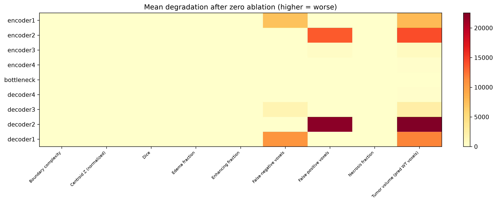

# Decodable Is Not Controllable
## Probing and Editing Anatomical Representations in a 3D U-Net

[](https://www.python.org/downloads/)
[](https://pytorch.org/)
[](https://www.synapse.org/#!Synapse:syn27046444)

**Thesis:** Late U-Net decoder representations contain linearly accessible anatomical information, but linear recoverability does not guarantee selective causal control. Probe-aligned editing weakly steers edema composition beyond matched random perturbations, whereas a highly predictive whole-tumor voxel-count direction changes its analytical readout without producing probe-specific downstream volume control.

---

## Thirty-second overview

This repository documents a mechanistic case study of a trained 3D U-Net on BraTS 2021 (375 validation cases). We ask whether properties that are linearly decodable from internal activations can also be selectively manipulated by editing those activations along probe-derived directions.

The answer is mixed—and that asymmetry is the point. Edema fraction at decoder1 is weakly steerable beyond random controls. Whole-tumor voxel count at decoder2 is strongly decodable (R² = 0.822) yet not steerable in a probe-specific way: matched random perturbations change predicted whole-tumor voxel count as much as the probe direction does.

---

## Central comparison

| Result | Edema at decoder1 | Whole-tumor voxel count at decoder2 |
|---|---:|---:|
| OOF Ridge probe R² | 0.596 | 0.822 |
| Probe edit effect | 2.08 percentage points | 3.82 voxels |
| Matched-random effect | 0.88 percentage points | 4.45 voxels |
| Probe/random ratio | 2.36× | 0.86× |
| Interpretation | Weak semantic steering | Decodable, not a downstream control axis |

*Probe edit effects in the table come from the 30-case matched-random screens (`edema_probe_screen_summary.csv`, `volume_probe_screen_summary.csv`). Full-cohort editing means are in `editing_summary.csv` (375 cases): edema |Δ| = 2.03 pp at α = +1 and 2.05 pp at α = −1; 4.08 pp at α = +2 and 4.17 pp at α = −2.*

---

## Research question

**Does linearly decodable anatomical information in a segmentation network imply that the same representation can be selectively controlled?**

We separate three forms of evidence often conflated in representation analysis:

1. **Recoverability** — Can a property be read out from activations?
2. **Functional dependence** — Does disrupting a layer damage segmentation?
3. **Controllability** — Can a targeted intervention change the corresponding output property?

---

## Why decodability ≠ controllability

A Ridge probe identifies a direction correlated with a property in representation space. Editing along that direction tests whether the network *uses* that axis for downstream control. These need not coincide: correlations can reflect encoding without providing an intervention handle the decoder exploits.

Tissue fractions are compositional (edema, enhancing, necrosis sum within tumor), so off-target coupling is expected even when on-target movement is real. Whole-layer mean ablation tests **functional dependence on intact spatial activations**; it does **not** establish that any single probe direction is causally necessary.

---

## Study design

| Stage | Method | Scale |
|---|---|---|
| Linear probing | Fold-safe Ridge on global-pooled activations | 375 val cases, all encoder/decoder layers |
| Layer ablation | Replace layer activations with channel means; score vs matched sliding-window baseline | **375 / 375** cases |
| Representation editing | A′ = A + αΔ, Δ from probe adjoint lift | 375 val cases, multiple properties |
| Matched-random controls | Unit random directions, same \|α\| and RMS budget | 30 stratified cases per screen |

**Model:** 3D U-Net, 10-hour BraTS training run, **epoch 5** checkpoint. **Intervention:** spatially constant per-channel perturbation broadcast across the activation map.

Probe targets are derived from ground-truth anatomy or segmentation quality, whereas intervention effects are measured from the model's edited predicted segmentation.

**Ablation baseline:** Primary results use a **matched sliding-window baseline** (same overlap and patch grid as the ablation forward pass; no TTA). Scoring against TTA validation predictions is reported as a robustness check.

---

## Main findings

### Probing (best layer per target, 5-fold OOF R² on 375 cases)

| Property | Layer | R² |
|---|---|---:|
| Whole-tumor voxel count | decoder2 | 0.822 |
| Enhancing fraction | decoder1 | 0.647 |
| Edema fraction | decoder1 | 0.596 |
| Dice | decoder1 | 0.565 |
| Necrosis fraction | decoder1 | 0.525 |
| Boundary complexity | decoder2 | 0.430 |
| Boundary error | decoder1 | 0.415 |

*Source: `outputs_10hour/layer_analysis/layer_recoverability.csv`*

### Editing (375 cases)

- Decoder1 tissue-fraction edits were **monotonic but small** (edema |Δ| = 2.03 pp at α = +1 and 2.05 pp at α = −1; 4.08 pp at α = +2 and 4.17 pp at α = −2; `editing_summary.csv`).
- Edits caused **substantial off-target changes** in other tissue properties and whole-tumor voxel count.
- **Dice changes were negligible**; no evidence of segmentation repair.

### Matched-random screens (small; not significance tests)

**Edema (decoder1):** 30 cases, 3 random directions, |α| = 1. Probe mean |Δedema| = 0.02079 vs random 0.00880 (ratio 2.36; `edema_probe_screen_summary.csv`). Weak target-related steering beyond a generic same-sized perturbation, but not selective control.

**Whole-tumor voxel count (decoder2):** 30 cases, 5 random directions, |α| = 1. Probe mean absolute change = 3.82 voxels vs random 4.45 (ratio 0.86; 47.3rd percentile; `volume_probe_screen_summary.csv`). +α/−α flipped analytical Ridge predictions in 100% of cases (30/30) but predicted whole-tumor voxel count in 56.7% of cases (17/30).

### Layer ablation (375 cases; matched sliding-window baseline)

Mean ablation replaces each layer’s activation map with its per-channel spatial mean. Primary scoring uses a matched non-TTA sliding-window baseline (`matched_baseline/`).

| Rank | Layer | Mean Dice degradation |
|------|-------|----------------------:|
| 1 | decoder1 | 0.889 |
| 2 | encoder1 | 0.498 |
| 3 | decoder2 | 0.399 |
| 4 | encoder2 | 0.273 |
| 5 | decoder3 | 0.055 |
| 6 | encoder3 | 0.027 |
| 7 | encoder4 | 0.001 |
| 8 | bottleneck | −0.000 |
| 9 | decoder4 | −0.002 |

*Source: `outputs_10hour/layer_interventions/matched_baseline/baseline_comparison.csv` (matched_baseline_dice_degradation).*

**Interpretation:** Late decoder and early encoder stages show strong **functional dependence on intact spatial activations** for Dice. The bottleneck shows essentially no Dice degradation under mean ablation despite strong location recoverability in probing.

**Robustness (TTA baseline):** Rescoring the same ablated masks against TTA validation predictions yields the **identical layer ranking** (Spearman ρ = 1.000). Absolute Dice degradations differ by a uniform +0.006 (matched − TTA), reflecting a slightly higher matched baseline Dice (0.889 vs 0.883). Top-3 layers are unchanged: decoder1, encoder1, decoder2 (`baseline_comparison.md`).

---

## Interpretation

The strongest whole-tumor voxel-count probe in this study is among the weakest editors. Predictive probe directions may reflect naturally occurring representation correlations rather than axes the downstream network treats as control handles. Edema at decoder1 shows the opposite partial pattern: modest semantic steering beyond random, coupled across tissue properties.

Ablation further separates recoverability from functional dependence: bottleneck location is highly decodable, yet mean ablation of the bottleneck barely changes Dice, whereas decoder1/decoder2 show strong functional dependence on intact spatial activations.

This is a mechanistic readout-versus-control analysis, not a clinical correction method.

---

## Key figures

**Layer recoverability (locked holdout R²)**


*This heatmap uses a separate 187-case selection / 188-case locked-test split (`layer_holdout_recoverability/`). R² values therefore differ from the full-cohort 5-fold OOF probing table above.*

**Editing dose–response**


**Edema probe vs random (30-case screen)**


**Whole-tumor voxel count: analytical probe change vs actual segmentation change**


**Layer ablation: mean Dice degradation by layer (matched baseline)**



---

## What this study establishes

- On this U-Net, late decoder layers encode anatomical properties with substantial linear recoverability.
- Probe-aligned additive edits can weakly steer some tissue-composition outputs.
- A highly predictive whole-tumor voxel-count direction does not provide probe-specific downstream volume control in this setting.
- Recoverability, functional dependence on intact spatial activations (ablation), and selective controllability are distinct and can diverge.
- Ablation layer rankings are stable under matched vs TTA baselines (Spearman ρ = 1.000).

---

## Limitations

- Single checkpoint and additive, globally broadcast interventions.
- Tissue fractions are compositional and partially coupled.
- Random-control screens are small exploratory checks, not powered hypothesis tests.
- Whole-layer ablation is destructive and not property-specific; it measures functional dependence on intact spatial activations, not probe-direction necessity.
- Checkpoints, embeddings, and raw predictions are not stored in git.

---

## Reproduction

**Prerequisites:** BraTS 2021 data, Python environment (`requirements.txt`), trained checkpoint at `outputs_10hour/checkpoints/checkpoint_latest.pt` (epoch 5; not in git).

```bash
python -m venv .venv && source .venv/bin/activate
pip install -r requirements.txt
# Set data.root in configs/ten_hour.yaml
```

**Inspect committed results** (no GPU required):

```bash
# Tables and reports under outputs_10hour/
```

**Re-run analysis** (requires local checkpoint + layer embeddings from `export_layer_embeddings.py`):

```bash
python export_layer_embeddings.py \
  --config configs/ten_hour.yaml \
  --checkpoint outputs_10hour/checkpoints/checkpoint_latest.pt \
  --failure-table outputs_10hour/failure_tables/failure_metrics.csv \
  --output-dir outputs_10hour/layer_embeddings

python analyze_layer_holdout_recoverability.py \
  --layer-index outputs_10hour/layer_embeddings/layer_embedding_index.csv \
  --failure-table outputs_10hour/failure_tables/failure_metrics.csv

python learn_semantic_directions.py \
  --config configs/ten_hour.yaml \
  --checkpoint outputs_10hour/checkpoints/checkpoint_latest.pt \
  --layer-index outputs_10hour/layer_embeddings/layer_embedding_index.csv \
  --failure-table outputs_10hour/failure_tables/failure_metrics.csv \
  --output-dir outputs_10hour/semantic_directions

python analyze_representation_editing.py \
  --config configs/ten_hour.yaml \
  --checkpoint outputs_10hour/checkpoints/checkpoint_latest.pt \
  --failure-table outputs_10hour/failure_tables/failure_metrics.csv \
  --directions-dir outputs_10hour/semantic_directions \
  --output-dir outputs_10hour/representation_editing

python analyze_edema_probe_screen.py \
  --config configs/ten_hour.yaml \
  --checkpoint outputs_10hour/checkpoints/checkpoint_latest.pt \
  --failure-table outputs_10hour/failure_tables/failure_metrics.csv

python analyze_volume_probe_screen.py \
  --config configs/ten_hour.yaml \
  --checkpoint outputs_10hour/checkpoints/checkpoint_latest.pt \
  --failure-table outputs_10hour/failure_tables/failure_metrics.csv \
  --n-random 5

python analyze_layer_interventions.py \
  --config configs/ten_hour.yaml \
  --data-root /path/to/BraTS2021_Training_Data \
  --checkpoint outputs_10hour/checkpoints/checkpoint_latest.pt \
  --failure-table outputs_10hour/failure_tables/failure_metrics.csv \
  --output-dir outputs_10hour/layer_interventions \
  --save-predictions

python analyze_layer_interventions.py \
  --config configs/ten_hour.yaml \
  --data-root /path/to/BraTS2021_Training_Data \
  --checkpoint outputs_10hour/checkpoints/checkpoint_latest.pt \
  --failure-table outputs_10hour/failure_tables/failure_metrics.csv \
  --output-dir outputs_10hour/layer_interventions \
  --recompute-matched-baseline
```

Precomputed summaries: `outputs_10hour/representation_editing/`, `outputs_10hour/edema_probe_screen/`, `outputs_10hour/volume_probe_screen/`, `outputs_10hour/layer_interventions/matched_baseline/`.

---

## Repository structure

```text
configs/ten_hour.yaml
analyze_layer_holdout_recoverability.py   # Probing
learn_semantic_directions.py              # Probe → edit directions
analyze_representation_editing.py         # Full editing cohort
analyze_edema_probe_screen.py           # Edema vs random (30 cases)
analyze_volume_probe_screen.py            # Whole-tumor voxel count vs random (30 cases)
analyze_layer_interventions.py            # Whole-layer ablation + matched-baseline rescore
export_layer_embeddings.py                # Activation export (local)
outputs_10hour/                           # Curated CSVs, figures, directions
outputs_10hour/layer_interventions/matched_baseline/  # Primary ablation summaries
docs/previous_work/                       # Archived uncertainty study
docs/manuscript/                          # Manuscript-facing notes
```

---

## Data governance and license

Code is released for research. BraTS 2021 use is subject to [Synapse terms](https://www.synapse.org/#!Synapse:syn27046444). No patient identifiers are included in committed artifacts. BraTS: Menze et al., CVPR 2015; Bakas et al., 2017–2021.

No `LICENSE` file is present in this repository; license terms have not been finalized.

---

## Project origins

This repository began as an investigation of whether bottleneck embeddings complement TTA uncertainty for segmentation-quality estimation without ground truth. Those experiments motivated the present mechanistic question: *what do internal representations encode, and can they be manipulated?*

The earlier uncertainty-and-geometry analysis is archived at [`docs/previous_work/uncertainty_quality_estimation.md`](docs/previous_work/uncertainty_quality_estimation.md).
