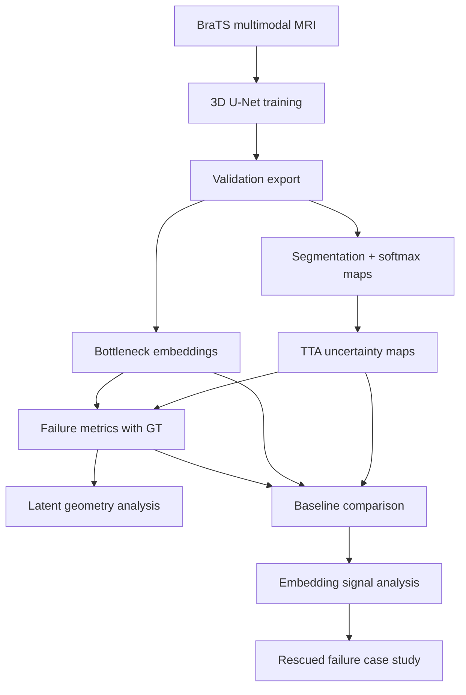
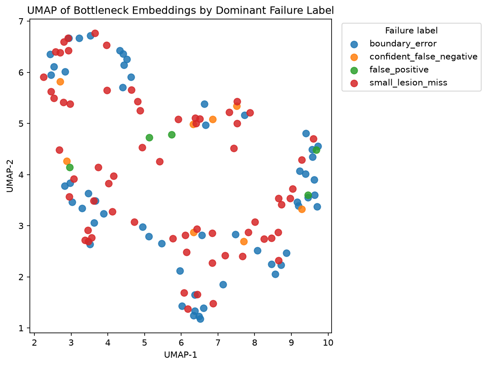
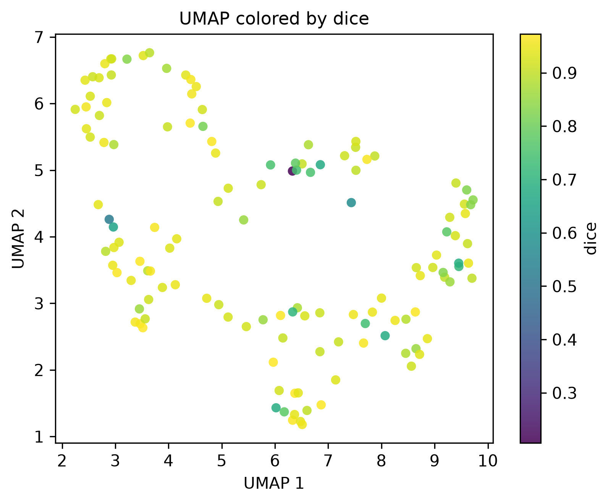
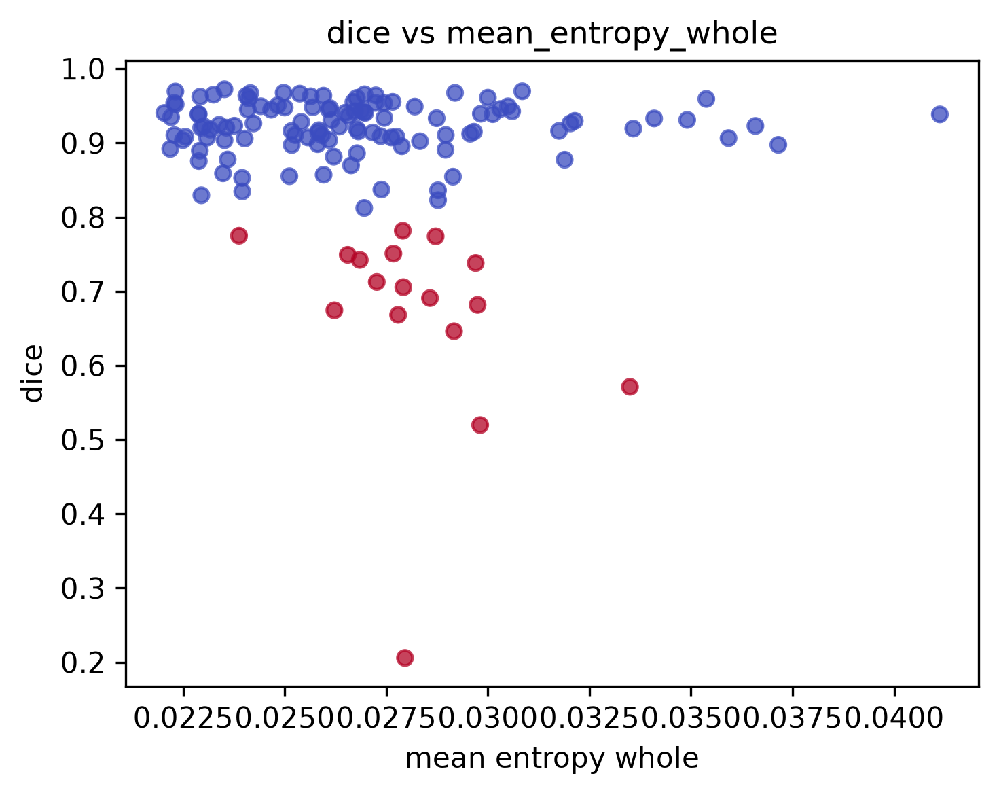
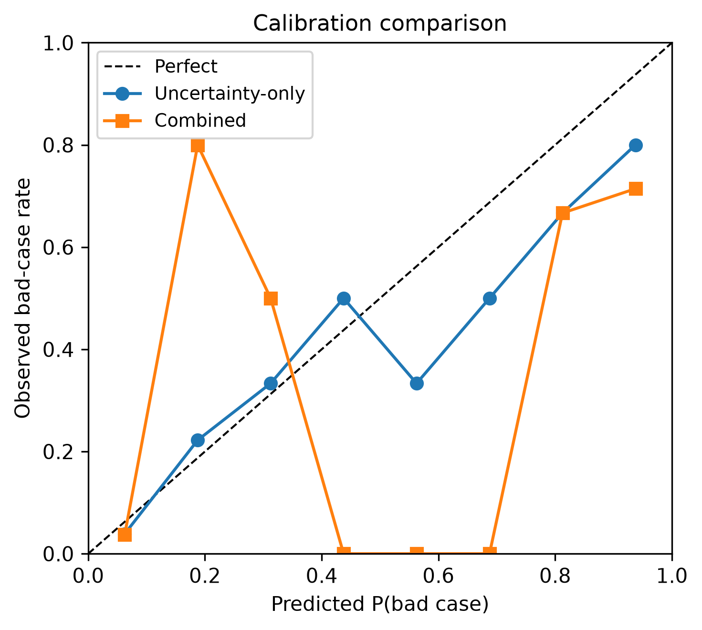
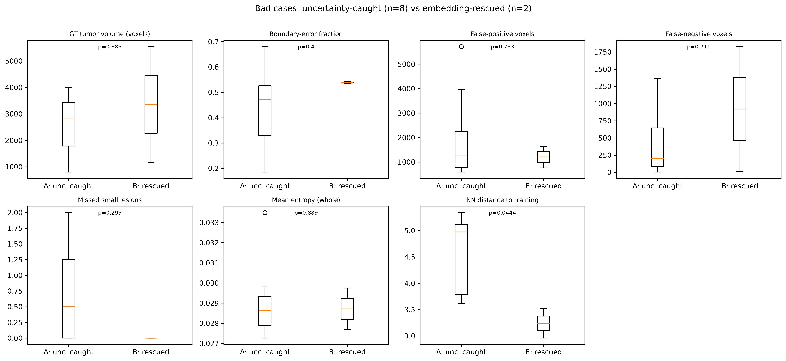
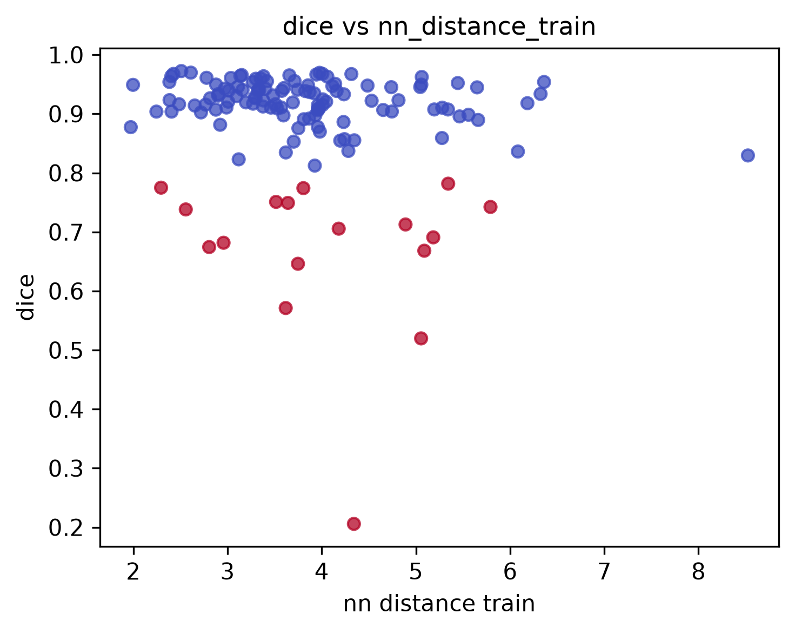

# Latent Representations and Uncertainty for Segmentation Quality Estimation

[](https://www.python.org/downloads/)
[](https://pytorch.org/)
[](https://www.synapse.org/#!Synapse:syn27046444)
[]()

**An ongoing investigation into whether internal latent representations provide complementary information to uncertainty for estimating MRI segmentation quality—when ground truth is unavailable at deployment time.**

---

## Motivation

MRI brain tumor segmentation models routinely report high average Dice scores on benchmark datasets. In clinical use, however, performance is judged **case by case**: a single poor segmentation on a difficult scan can have meaningful consequences, and the clinician does not have access to the ground-truth segmentation at inference time.

A natural approach is to estimate whether a segmentation can be trusted using **predictive uncertainty**—for example, entropy of the softmax distribution under test-time augmentation (TTA). Uncertainty-based quality estimation is an active and well-studied direction.

This project asks a related but distinct question: **does the model's own bottleneck latent representation encode information about segmentation quality that is not already captured by deployable uncertainty summaries?** Internal representations are used throughout representation-learning and failure-analysis work; our focus is on their role in **quality estimation without ground truth**, and on understanding *what* they encode when combined with uncertainty.

We do not claim this framing is wholly novel. Rather, we aim to characterize—empirically and mechanistically—when and why latent geometry might help, and when uncertainty alone is sufficient.

---

## Research Questions

1. **Can latent bottleneck representations predict segmentation failures** (e.g., cases with Dice below a clinical threshold)?
2. **Do latent representations encode different information than uncertainty?** Are they redundant, complementary, or largely orthogonal?
3. **What information is stored in the latent representation?** Anatomy, tumor burden, failure morphology, distributional novelty, or a mixture?
4. **When does combining latent representations with uncertainty improve failure detection?** Under what failure modes does geometry add value?
5. **Which cases does the combined model rescue** that uncertainty alone misses—and what do those cases look like morphologically?

---

## Current Pipeline

The repository implements an end-to-end experimental pipeline on BraTS-style multimodal MRI:



| Step | Script | Description |
|------|--------|-------------|
| 1 | `train.py` | Train a standard 3D U-Net on BraTS with Dice + CE loss |
| 2 | `train.py --export-only` | Export per-case predictions, softmax maps, and bottleneck embeddings |
| 3 | `train.py --export-uncertainty` | Generate TTA-averaged probabilities and voxelwise entropy |
| 4 | `analyze_failures.py` | Compute failure taxonomy metrics (boundary error, FP/FN, small lesions, etc.) |
| 5 | `analyze_geometry.py` | UMAP projection, kNN label agreement, cluster analysis |
| 6 | `compare_baselines.py` | Cross-validated bad-case detection: uncertainty vs geometry vs combined |
| 7 | `analyze_embedding_signal.py` | Mechanistic analysis of what embeddings add beyond uncertainty |
| 8 | `analyze_rescued_bad_cases.py` | Compare uncertainty-caught vs embedding-rescued failures |

**Design principle:** Deployable quality features use only model outputs available at inference (entropy maps, predicted masks, embeddings). Ground-truth-derived metrics are used for **evaluation and interpretation**, not as classifier inputs.

---

## Current Findings

> **Note:** The following are *current experimental observations* from internal runs on BraTS 2021. They are not final conclusions. A larger full-dataset experiment (`outputs_10hour`, 375 validation cases) is in progress.

### Bad-case detection (Dice &lt; 0.80, logistic regression, 5-fold CV)

Primary completed run: **533 cases** (400 train / 133 validation), 5 training epochs.

| Feature set | AUROC | AUPRC | F1 | Status |
|-------------|-------|-------|-----|--------|
| Uncertainty only | **0.886** | 0.641 | 0.533 | Completed |
| Geometry only (embeddings + kNN) | 0.764 | 0.457 | 0.368 | Completed |
| Combined | **0.909** | 0.633 | 0.452 | Completed |

### Continuous Dice regression (deployable features, Ridge CV)

| Feature set | Pearson *r* | R² |
|-------------|-------------|-----|
| Uncertainty only | **0.60** | **0.36** |
| Geometry only | 0.41 | 0.15 |
| Combined | 0.43 | 0.16 |

### Summary of observations

- **Uncertainty is currently the strongest standalone quality signal** for both binary failure detection and continuous Dice estimation.
- **Latent representations alone underperform uncertainty** on aggregate metrics (AUROC 0.76 vs 0.89).
- **Combining latent representations with uncertainty modestly improves severe failure detection** (AUROC +0.023 on the 533-case run). The gain is small but repeatable in our setup.
- **Latent representations appear to encode anatomical and morphological structure**—tumor burden, boundary-error fraction, failure morphology—rather than simply reproducing voxelwise entropy (top correlated dimensions align with boundary error and tumor volume).
- **Continuous Dice regression is dominated by uncertainty**; embeddings do not improve linear Dice prediction and may hurt when used naïvely at full dimensionality.
- **Latent geometry is weakly clustered by failure type** (kNN label agreement ≈ 0.43, silhouette &lt; 0), suggesting failures are not cleanly separated in embedding space.
- **Early evidence from rescued-case analysis:** a small subset of bad cases (2/17 in the primary run) are missed by uncertainty but flagged by the combined model. These cases tend toward **boundary-heavy failures with low deployable entropy**—structurally difficult but not high-uncertainty. This pattern is suggestive but requires validation on larger holdouts.

### Figures (533-case validation run)

**UMAP of validation cases colored by dominant failure label**



**UMAP colored by Dice** — failures are intermixed with high-performing cases; no simple geometric separation.



**Uncertainty vs Dice** — uncertainty separates many bad cases, but not all.



**Calibration: uncertainty-only vs combined** bad-case classifiers (out-of-fold)



**Rescued failures: Group A (uncertainty catches) vs Group B (combined rescues)** — morphology comparison across tumor volume, boundary error, entropy, and training-set distance.



**Distance to training manifold vs Dice** — weak novelty signal; embeddings encode more than distributional distance alone.



---

## Repository Structure

```
segmentation-failure-analysis/
├── configs/                    # Experiment configs (scale, epochs, val fraction)
│   ├── default.yaml
│   ├── five_epoch_533.yaml     # Primary completed 533-case run
│   ├── ten_hour.yaml           # Full-dataset experiment (in progress)
│   └── thirty_min.yaml         # Fast smoke test (30 val cases)
├── src/
│   ├── data/                   # BraTS loading, preprocessing, splits
│   ├── models/                 # 3D U-Net with bottleneck embedding head
│   ├── training/               # Trainer, sliding-window inference, TTA
│   └── analysis/
│       ├── failure_taxonomy.py # Failure label definitions
│       ├── geometry.py         # UMAP, kNN, clustering metrics
│       ├── baselines.py        # Uncertainty / geometry / combined CV
│       └── embedding_signal.py # Mechanistic embedding analysis
├── scripts/                    # End-to-end pipeline shell scripts
├── docs/figures/               # README figures (copied from experiment outputs)
├── train.py
├── analyze_failures.py
├── analyze_geometry.py
├── compare_baselines.py
├── analyze_embedding_signal.py
├── analyze_rescued_bad_cases.py
└── requirements.txt
```

Runtime experiment outputs (`outputs_*`) are gitignored. Reproduce locally following the instructions below.

---

## Reproducing Experiments

### Setup

```bash
python -m venv .venv
source .venv/bin/activate
pip install -r requirements.txt
```

Download [BraTS 2021 training data](https://www.synapse.org/#!Synapse:syn27046444) and set `data.root` in your config YAML.

### Full pipeline (example: 533-case run)

```bash
# 1. Train + export validation artifacts
python train.py --config configs/five_epoch_533.yaml --epochs 5

# 2. TTA uncertainty export
python train.py --config configs/five_epoch_533.yaml \
  --export-uncertainty \
  --checkpoint outputs_5epoch_533/checkpoints/checkpoint_epoch_005.pt

# 3. Failure metrics
python analyze_failures.py \
  --metrics outputs_5epoch_533/metrics_uncertainty.csv \
  --output outputs_5epoch_533/failure_tables/failure_metrics.csv

# 4. Latent geometry
python analyze_geometry.py \
  --failure-table outputs_5epoch_533/failure_tables/failure_metrics.csv \
  --output-dir outputs_5epoch_533/geometry

# 5. Baseline comparison
python compare_baselines.py \
  --failure-table outputs_5epoch_533/failure_tables/failure_metrics.csv \
  --geometry-table outputs_5epoch_533/geometry/umap_coordinates.csv \
  --output-dir outputs_5epoch_533/baselines \
  --bad-case-mode threshold --dice-threshold 0.80

# 6. Embedding signal analysis (exports train embeddings on first run)
python analyze_embedding_signal.py \
  --failure-table outputs_5epoch_533/failure_tables/failure_metrics.csv \
  --geometry-table outputs_5epoch_533/geometry/umap_coordinates.csv \
  --baseline-results outputs_5epoch_533/baselines/baseline_results.csv \
  --output-dir outputs_5epoch_533/embedding_signal \
  --config configs/five_epoch_533.yaml \
  --checkpoint outputs_5epoch_533/checkpoints/checkpoint_epoch_005.pt \
  --epoch 5

# 7. Rescued failure case study (fast if train embeddings cached)
python analyze_rescued_bad_cases.py \
  --failure-table outputs_5epoch_533/failure_tables/failure_metrics.csv \
  --geometry-table outputs_5epoch_533/geometry/umap_coordinates.csv \
  --output-dir outputs_5epoch_533/embedding_signal \
  --train-embedding-dir outputs_5epoch_533/train_embeddings/epoch_005
```

Or run a scripted pipeline:

```bash
bash scripts/run_midscale_pipeline.sh   # 533-case config
bash scripts/run_10hour_pipeline.sh     # full dataset (long-running)
```

### Experiment status

| Experiment | Train / Val | Val cases | Pipeline | Status |
|------------|-------------|-----------|----------|--------|
| `outputs_30min` | 90 / 30 | 30 | Full | Completed (exploratory; high variance) |
| `outputs_5epoch_533` | 400 / 133 | 133 | Full + embedding signal | **Completed** |
| `outputs_10hour` | ~876 / 375 | 375 | Full | **In progress** (TTA export) |

---

## Current Limitations

- **Single dataset:** All experiments to date use BraTS 2021. Generalization to other sites, sequences, and pathologies is unknown.
- **Single architecture:** A custom 3D U-Net with a global-average-pooled bottleneck embedding—not nnU-Net or other strong baselines.
- **Modest effect sizes:** Combined-model AUROC improvements are small (+0.02–0.03). Statistical power for subgroup analyses (e.g., rescued cases, *n* = 2) is limited.
- **Mechanistic interpretation is incomplete:** Individual embedding dimensions correlate with morphology, but a full causal account of what each dimension encodes remains open.
- **Train-reference geometry is expensive:** Novelty analysis requires exporting embeddings for all training cases (~400–900 cases of sliding-window inference).
- **No prospective clinical validation:** This is offline benchmark research, not a deployed clinical system.
- **Small-sample caveats:** Pilot runs (30 validation cases) can show inflated geometry AUROC; we treat them as qualitative only.

---

## Future Directions

- [ ] Complete and report the **full-dataset** BraTS experiment (`outputs_10hour`, 375 validation cases)
- [ ] **External dataset validation** (different BraTS years, institutional holdouts)
- [ ] **Multi-layer representation analysis** (encoder stages vs bottleneck)
- [ ] **Alternative segmentation backbones** (nnU-Net, transformer hybrids)
- [ ] **Mechanistic interpretation** of latent dimensions (probing, ablation, concept activation)
- [ ] **Richer failure modes** beyond whole-tumor Dice (per-region, per-lesion)
- [ ] **Interactive analysis** with [MANTIS](https://github.com/KnowledgeLab/MANTIS) for embedding-space exploration
- [ ] **Prospective / reader studies** on whether quality estimates change clinical workflow decisions

---

## Summary: What Embeddings Add—and Why It Matters

This section synthesizes our **current** evidence on a practical question: *if uncertainty is already a strong quality signal, why include latent representations at all?*

### What we observe for severe failures (Dice &lt; 0.80)

On the primary 533-case validation run (17 bad cases, stratified 5-fold CV, logistic regression):

| Model | AUROC | Interpretation |
|-------|-------|----------------|
| Uncertainty only | **0.886** | Strong baseline—uncertainty catches most catastrophic failures |
| Embeddings only | 0.764 | Weaker alone—geometry without uncertainty is insufficient |
| **Uncertainty + embeddings** | **0.909** | **Best**—modest but consistent improvement (+0.023 AUROC) |

**Important nuance:** Embeddings do **not** outperform uncertainty in isolation. The finding is that they provide **complementary** signal when combined. For flagging the worst segmentations (Dice &lt; 0.80), the combined model is currently our best deployable estimator.

The calibration plot below shows that combined out-of-fold probabilities track observed bad-case rates slightly more faithfully than uncertainty alone—useful when the goal is ranking cases for review, not estimating exact Dice.


### What information embeddings encode that uncertainty misses

Mechanistic analysis (`analyze_embedding_signal.py`) shows that bottleneck dimensions correlate most strongly with **morphology and anatomy**, not with deployable entropy:

| Embedding feature | Correlates with | Pearson *r* (133 val) |
|-------------------|-----------------|----------------------|
| `emb_89` | Boundary-error fraction | **+0.43** |
| `emb_11` | Dice | **−0.42** |
| `emb_38` | GT tumor volume | **+0.36** |
| `emb_38` | Boundary-error fraction | **+0.38** |
| `pc_4` (PCA) | Tumor volume + boundary error | **~0.36** |
| `emb_74` | Mean entropy (whole) | +0.39 |

The **strongest** embedding–outcome associations are with **boundary complexity, tumor burden, and failure morphology**. Entropy-correlated dimensions exist (`emb_74`, `emb_69`) but are not the dominant story. This supports the hypothesis that the bottleneck compresses **structural context** about the case—how large the tumor is, how boundary-heavy errors tend to be—not a second copy of the voxelwise uncertainty map.

The UMAP below shows that Dice varies continuously across embedding space while failure types intermingle; there is no single “failure island,” but **local geometry still carries case-specific structure** that a classifier can exploit alongside uncertainty.


Uncertainty vs Dice (deployable entropy summaries) explains much of the variance, but **several bad cases sit in a low-entropy, low-Dice region** that uncertainty alone under-ranks:


### Case-level evidence: which failures get “rescued”?

We split the 17 bad cases by out-of-fold classifier behavior:

| Group | Definition | *n* | Role |
|-------|------------|-----|------|
| **A** | Uncertainty catches (P_bad ≥ 0.5) | 8 | Obvious failures—high uncertainty, often very low Dice |
| **B** | Uncertainty misses, **combined rescues** | 2 | **Key cases**—look confident to uncertainty, flagged by geometry |
| **D** | Both miss | 7 | Often borderline Dice (0.70–0.78); threshold-limited |

**Group B cases** (`BraTS2021_00380`, `BraTS2021_00555`):

| Case | Dice | P_unc | P_combined | Dominant failure | Boundary-error frac. | Mean entropy |
|------|------|-------|------------|------------------|----------------------|--------------|
| 00380 | 0.751 | 0.30 | **0.86** | boundary_error | 0.54 | 0.028 |
| 00555 | 0.682 | 0.50 | **0.86** | boundary_error | 0.53 | 0.030 |

Both are **boundary-heavy, low-entropy failures**—morphologically difficult but not flagged as uncertain. The combined model assigns P(bad) ≈ 0.86 using embedding geometry that uncertainty alone does not surface.

Comparing Group A vs Group B across morphology (boxplots below):

- **Boundary-error fraction:** higher in Group B (mean 0.54 vs 0.44)—the failures embeddings help with are structurally boundary-dominated.
- **Mean entropy:** essentially **unchanged** (0.029 vs 0.029)—rescued cases are not high-uncertainty outliers.
- **False-negative voxels:** directionally higher in Group B (919 vs 412)—missed tumor tissue without corresponding entropy spikes.


This is early evidence with **n = 2** rescued cases; we treat it as hypothesis-generating, not proven. The full-dataset run (375 validation cases) will test whether the pattern holds at scale.

### Why this is useful (without overselling)

In deployment, clinicians and QA workflows need to **prioritize cases for review** when ground truth is unavailable. Uncertainty is the right first signal—it catches most clear failures. Our results suggest a **second line of defense**:

1. **Uncertainty** flags cases where the model knows it is unsure.
2. **Latent geometry** flags a subset of cases where the model appears confident but the **case-level anatomy** resembles historically difficult segmentations—especially boundary-heavy morphology.

That combination is clinically relevant because:

- **Review budget is finite.** A small AUROC gain (+0.02–0.03) can still reorder which cases reach human review first.
- **Confident errors are especially dangerous.** A segmentation that looks stable (low entropy) but is wrong is less likely to be caught by uncertainty-only QA.
- **The signal is interpretable.** Embeddings correlate with measurable morphology (boundary error, tumor volume), not opaque scores—supporting mechanistic follow-up.

We do **not** claim embeddings replace uncertainty or that latent geometry solves failure detection. We claim that **internal representations encode morphological structure that deployable uncertainty summaries partially miss**, and that combining the two improves detection of severe failures in our current BraTS experiments.

### What would make this a stronger scientific claim

- Replicate rescued-case patterns on the **375-case** full-data holdout (in progress)
- Formal significance testing with more bad cases per subgroup
- Per-dimension probing to link `emb_89`-style dimensions to boundary morphology
- External validation beyond BraTS 2021

Until then, label these results **current experimental observations**—directionally consistent, modest in effect size, and mechanistically plausible.

---

## Collaboration

This repository documents an **ongoing research effort** into the relationship between latent representations, uncertainty estimation, and segmentation quality. We are actively iterating on experiments, analysis methods, and interpretation.

If you work on medical imaging, uncertainty quantification, representation learning, or failure analysis, we welcome feedback, critical discussion, and research collaborations. Please open an issue or reach out via GitHub.

---

## Citation

If you use this code in academic work, please cite the repository (BibTeX forthcoming) and acknowledge the BraTS challenge data:

```
@misc{segmentation_failure_analysis2026,
  author       = {Mangalampalli, Aniket},
  title        = {Latent Representations and Uncertainty for Segmentation Quality Estimation},
  year         = {2026},
  publisher    = {GitHub},
  howpublished = {\url{https://github.com/DarkPhantom738/segmentation-failure-analysis}}
}
```

BraTS data: Menze et al., CVPR 2015; Bakas et al., 2017, 2018, 2021.

---

## License

Code is released for research purposes. BraTS data use is subject to the [Synapse terms](https://www.synapse.org/#!Synapse:syn27046444). A formal open-source license for this repository will be added.
