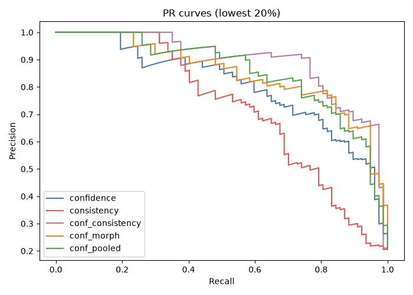

# Anatomical Representation–Output Consistency Improves Confidence-Based Failure Triage in 3D Brain Tumor Segmentation

[](https://www.python.org/downloads/)
[](https://pytorch.org/)
[](https://www.synapse.org/#!Synapse:syn27046444)

This project studies the internal representations of a 3D U-Net for BraTS brain-tumor segmentation. Anatomical properties can often be decoded from those activations, but probe-derived edit directions did not consistently control or repair the final mask. What did help was measuring when the anatomy implied by a representation disagrees with the anatomy of the predicted mask, then combining those disagreements with ordinary inference-time confidence.

In one sentence: this project helps a brain-tumor segmentation model flag which of its predictions are most likely to need human review.

---

## Research questions

**RQ1.** How closely are anatomical recoverability, functional dependence, and controllability related within a three-dimensional medical segmentation network?

We test this with three complementary probes on the same frozen U-Net: fold-safe linear probing (can anatomy be read out?), spatial mean ablation (does the layer need intact spatial structure?), and probe-aligned editing with matched random controls (does a decoded direction selectively move the output?).

**RQ2.** Even when decoded anatomical directions are unsuitable for controlling the output, can the underlying representation still contribute to reliability assessment?

We hypothesized that disagreement between an anatomical property estimated from the hidden representation and the same property measured from the final mask could expose failures that conventional confidence does not capture. For example, the representation may indicate one tumor composition while the final segmentation expresses another, even when the output probabilities appear confident.

The positive endpoint is **failure triage**: rank cases for human review using confidence plus representation–output consistency gaps, evaluated under nested cross-validation on 375 held-out cases.

---

## Main result

On **375** BraTS 2021 validation cases. Primary endpoint: **lowest-quality 20%** by mean foreground Dice (77 positive cases). Evaluation: **nested CV** (5 outer / 4 inner folds, model seed 42) with **5000 paired case-level bootstrap** replicates. All methods share the same outer folds and failure labels.

**Detecting the lowest-quality 20% of segmentations:**

| Method | AUPRC | AUROC | Capture @ 20% review | Brier |
|---|---:|---:|---:|---:|
| Confidence only (primary baseline) | 0.805 | 0.931 | 71.4% | 0.102 |
| Confidence + morphology | 0.851 | 0.954 | 75.3% | 0.077 |
| Confidence + pooled representations | 0.854 | 0.948 | 74.0% | 0.081 |
| **Confidence + representation–output consistency** | **0.895** | **0.960** | **79.2%** | **0.064** |

**Confidence + consistency vs confidence only** (paired bootstrap):

| Metric | Δ (proposed − baseline) | 95% CI | P(proposed better) |
|---|---:|---|---:|
| AUPRC | **+0.090** | **[0.031, 0.152]** | 99.8% |
| Capture @ 20% | **+0.086** | **[0.013, 0.165]** | 97.7% |
| Mean Dice @ 80% coverage | +0.004 | [0.000, 0.009] | 98.2% |
| AURC (lower is better) | −0.001 | [−0.008, +0.006] | 44.5% |

**Secondary endpoint — mean foreground Dice &lt; 0.70** (73 cases):

| Method | AUPRC |
|---|---:|
| Confidence only | 0.770 |
| **Confidence + consistency** | **0.887** |

Bootstrap vs confidence: ΔAUPRC **+0.115** [0.056, 0.185], P(better) **100%**; ΔCapture@20 **+0.096** [0.016, 0.183], P(better) **98.8%**.

**Stability:** confidence + consistency wins **5/5** outer folds on both primary and secondary endpoints. Classifier-only retrain across seeds 42 / 123 / 2026 gives identical held-out scores (features frozen).

**Where it helps less:** edema-specific labels (`edema_lt_0.70`: ΔAUPRC +0.006 vs confidence; `lowest20_edema`: proposed 0.779 vs confidence 0.794). Morphology-augmented confidence is often stronger there.


Canonical numbers: `outputs_confidence_consistency_triage_20260712_030902/aggregate_metrics.csv`, `bootstrap_comparisons.csv`. Full baseline tables, ablations, and figures: `outputs_method_validation/validation_summary.md`.

---

## What we compare against (baselines) and why

The **primary baseline is confidence only**: case-level statistics derived from the model’s own **TTA-averaged softmax probabilities** on the predicted mask (8 flips, overlap 0.25). Features include foreground/boundary mean max-probability, predictive entropy, class-margin summaries, and low-confidence voxel fractions (`outputs_layer_aware_latent_risk/case_level_confidence_features.csv`).

We use this baseline because it is the standard cheap signal available **at inference time** without ground truth: if the network’s probabilities are flat or contradictory, the case may need review. We call this **predictive entropy**, not epistemic uncertainty—no separate mutual-information estimate is used.

**Augmented baselines** test whether consistency adds information beyond obvious alternatives:

| Baseline | What it uses | Why include it |
|---|---|---|
| **Morphology only** | Tumor composition, volume, and shape measured from the **predicted** mask | Captures anatomically implausible outputs without internal representations |
| **Confidence + morphology** | Both signal families | Strong composite QC baseline |
| **Pooled representations** | Global-pooled activations from nine U-Net stages | Tests whether raw embeddings alone flag failures |
| **Confidence + pooled** | Confidence + pooled reps | Representation-aware baseline without explicit consistency |
| **Direct Dice probe** | Ridge probe predicting Dice from representations | Tests whether a single quality readout beats structured gaps |
| **Consistency only** | Gap features without confidence | Shows gaps are not sufficient alone (AUPRC 0.725 primary) |

The proposed method **augments** confidence with representation–output gaps; it does not replace confidence. Consistency-only underperforms confidence-only on the primary endpoint.

**Feature ablation (primary endpoint):** removing enhancing-fraction gaps drops AUPRC from 0.886 to **0.773** (below confidence 0.805). Other anatomy families (edema, volume, necrosis, compactness) can be dropped with little or no loss—enhancing-composition disagreement carries most of the gain. (Will have to test further once I run on several seeds and test models till convergence rather than the current 5 epoch 10 hour model I am using currently.)

---

## What representation–output consistency means

For each anatomical property (for example enhancing-tumor fraction, edema fraction, or whole-tumor volume):

1. Fit a Ridge probe on a hidden layer (using ground truth only inside the training fold).
2. Read the same property from the **predicted** segmentation mask.
3. Record how far the two disagree.
4. Combine those gaps with confidence features (TTA max-probability, entropy, margin summaries, and related case-level statistics).
5. Score case-level failure risk with a logistic model under nested CV.

Gap features (conceptual; code column names may differ):

```text
signed_gap   = representation_estimate - predicted_mask_measurement
absolute_gap = abs(representation_estimate - predicted_mask_measurement)
relative_gap = abs(representation_estimate - predicted_mask_measurement)
               / (abs(predicted_mask_measurement) + epsilon)
```

**Inference-time rule:** the triage score does not take ground-truth masks or GT-linked error maps as inputs. Ground truth is used only to fit probes inside training folds, define failure labels, and evaluate held-out performance.

Refer to features as representation–output enhancing-fraction gaps, edema-fraction gaps, whole-tumor-volume gaps, and so on—even when code columns still use historical names.

**What drives the signal:** held-out permutation importance ranks enhancing-fraction relative gaps first (mean AUPRC drop **0.257** when shuffled). Top correlations with mean foreground Dice include enhancing-fraction relative gap (ρ = −0.30) and boundary-complexity gaps (|ρ| ≈ 0.23–0.26). See `outputs_method_validation/feature_permutation_importance.csv` and `feature_outcome_correlations.csv`.

---

## Study overview

| Item | Setting |
|---|---|
| Dataset | BraTS 2021 |
| Train / analysis split | 876 train / **375** internal validation |
| Inputs | T1, T1ce, T2, FLAIR |
| Model | Four-class 3D U-Net |
| Checkpoint | Epoch 5 from the ~10-hour training config (`configs/ten_hour.yaml`) |
| Stages analyzed | encoder1–4, bottleneck, decoder4–1 (nine stages) |

Four connected analyses on the same frozen model:

1. **Layer-wise linear probing** — full-cohort out-of-fold Ridge recoverability.
2. **Spatial mean ablation** — replace each layer map with its channel means; score Dice drop vs a matched sliding-window baseline.
3. **Probe-aligned editing** — add scaled probe directions; compare to matched random directions (exploratory **30-case** screens, plus full-cohort edit summaries).
4. **Confidence-augmented failure triage** — consistency gaps + confidence under leakage-safe nested CV (**375** cases).

Train/val provenance: `docs/manuscript/environment_and_split.md`.

---

## Mechanistic companion findings

Decode ≠ control, although this is already a known concept, it is still a novel finding that wasn't found in UNET/medical imaging in general.

### Full-cohort probe R² (375 cases, 5-fold OOF)

Source: `outputs_10hour/layer_analysis/layer_recoverability.csv`

| Property | Best layer | R² |
|---|---|---:|
| Whole-tumor volume (voxel count) | decoder2 | 0.822 |
| Enhancing-tumor fraction | decoder1 | 0.647 |
| Edema fraction | decoder1 | 0.596 |
| Dice | decoder1 | 0.565 |
| Necrotic / nonenhancing fraction | decoder1 | 0.525 |
| Boundary complexity | decoder2 | 0.430 |
| Boundary error | decoder1 | 0.415 |

The locked-holdout heatmap below uses a **separate** selection/test split, so its R² values are **not** the same estimates as this table.

### Editing (screens + full cohort)

Matched-random screens (n = 30 each; exploratory, not powered tests):

- Edema @ decoder1: probe / random absolute response ratio **2.36** (weak probe-specific steering).
- Whole-tumor volume @ decoder2: probe / random ratio **0.86**—strongly decodable, but the probe direction did not beat random for changing measured volume. Analytical Ridge movement (+α/−α opposite sign) was far more consistent than actual segmentation volume flips.

Full-cohort edema edits were small and monotonic; Dice barely moved. Editing is not a repair method here.

### Mean ablation (375 cases, matched baseline)

Dice degradation under spatial mean replacement:

| Layer | Mean Dice degradation |
|---|---:|
| decoder1 | 0.889 |
| encoder1 | 0.498 |
| decoder2 | 0.399 |
| bottleneck | ≈ 0 |

Spatial organization at the bottleneck was relatively insensitive to mean replacement under this intervention. That does **not** mean the bottleneck is unnecessary for the network as a whole.

Source: `outputs_10hour/layer_interventions/matched_baseline/baseline_comparison.csv`.

---

## Why this matters

Internal maps can encode anatomy. That does not automatically give a handle for reliable control or automatic correction. The same encoding can still be useful for monitoring: when the representation’s anatomical story disagrees with the mask the network emits, that mismatch adds information beyond confidence for spotting **overall** bad cases that may need review.

---

## Figures

**1. Layer recoverability (locked holdout)** — different split than the full-cohort table above.


**2. Whole-tumor volume: analytical probe response vs actual mask volume** (30-case screen).


**3. Failure-triage precision–recall** (canonical nested run).



**4. Failure capture vs review budget.**


---

## Repository structure

```text
configs/
  ten_hour.yaml
  confidence_consistency_triage.yaml
  method_validation.yaml
  consistency_failure_detection.yaml
  layer_aware_latent_risk.yaml
src/
  data/                 # BraTS loading / preprocessing
  models/               # 3D U-Net (+ exploratory repair modules)
  analysis/             # probing, editing, consistency, triage
outputs_10hour/
  layer_analysis/
  layer_holdout_recoverability/
  layer_interventions/
  representation_editing/
  edema_probe_screen/
  volume_probe_screen/
  failure_tables/
outputs_confidence_consistency_triage/
outputs_confidence_consistency_triage_20260712_030902/   # preferred canonical triage
outputs_method_validation/
outputs_layer_aware_latent_risk/                         # confidence CSV
outputs_consistency_failure_detection/
docs/
  manuscript/environment_and_split.md
  reporting_notes.md
```

Large artifacts (raw BraTS volumes, checkpoints, probability maps, layer `.npy` embeddings) are **not** stored in Git.

---

## Reproduction

### 1. Environment

```bash
python -m venv .venv && source .venv/bin/activate
pip install -r requirements.txt
# Point data.root at your local BraTS tree in configs/ten_hour.yaml
```

### 2. Data and checkpoint

You need locally:

- BraTS 2021 training data;
- epoch-5 / latest checkpoint under `outputs_10hour/checkpoints/` (not in Git);
- `outputs_10hour/failure_tables/failure_metrics.csv` (committed) for case lists and paths.

### 3. Representation extraction and probing

```bash
python export_layer_embeddings.py \
  --config configs/ten_hour.yaml \
  --checkpoint outputs_10hour/checkpoints/checkpoint_latest.pt \
  --failure-table outputs_10hour/failure_tables/failure_metrics.csv \
  --output-dir outputs_10hour/layer_embeddings

python analyze_layer_holdout_recoverability.py \
  --layer-index outputs_10hour/layer_embeddings/layer_embedding_index.csv \
  --failure-table outputs_10hour/failure_tables/failure_metrics.csv

python learn_semantic_directions.py \
  --config configs/ten_hour.yaml \
  --checkpoint outputs_10hour/checkpoints/checkpoint_latest.pt \
  --layer-index outputs_10hour/layer_embeddings/layer_embedding_index.csv \
  --failure-table outputs_10hour/failure_tables/failure_metrics.csv \
  --output-dir outputs_10hour/semantic_directions
```

### 4. Ablation and editing

```bash
python analyze_representation_editing.py \
  --config configs/ten_hour.yaml \
  --checkpoint outputs_10hour/checkpoints/checkpoint_latest.pt \
  --failure-table outputs_10hour/failure_tables/failure_metrics.csv \
  --directions-dir outputs_10hour/semantic_directions \
  --output-dir outputs_10hour/representation_editing

python analyze_edema_probe_screen.py \
  --config configs/ten_hour.yaml \
  --checkpoint outputs_10hour/checkpoints/checkpoint_latest.pt \
  --failure-table outputs_10hour/failure_tables/failure_metrics.csv

python analyze_volume_probe_screen.py \
  --config configs/ten_hour.yaml \
  --checkpoint outputs_10hour/checkpoints/checkpoint_latest.pt \
  --failure-table outputs_10hour/failure_tables/failure_metrics.csv \
  --n-random 5

python analyze_layer_interventions.py \
  --config configs/ten_hour.yaml \
  --data-root /path/to/BraTS2021_Training_Data \
  --checkpoint outputs_10hour/checkpoints/checkpoint_latest.pt \
  --failure-table outputs_10hour/failure_tables/failure_metrics.csv \
  --output-dir outputs_10hour/layer_interventions

python analyze_layer_interventions.py \
  --config configs/ten_hour.yaml \
  --data-root /path/to/BraTS2021_Training_Data \
  --checkpoint outputs_10hour/checkpoints/checkpoint_latest.pt \
  --failure-table outputs_10hour/failure_tables/failure_metrics.csv \
  --output-dir outputs_10hour/layer_interventions \
  --recompute-matched-baseline
```

### 5. Confidence-feature generation

Committed confidence table: `outputs_layer_aware_latent_risk/case_level_confidence_features.csv`.

To regenerate (needs checkpoint + local volumes; GPU/CPU heavy):

```bash
python scripts/run_layer_aware_latent_risk.py \
  --config configs/layer_aware_latent_risk.yaml \
  --stage confidence
```

### 6. Final confidence + consistency evaluation

Committed results can be inspected without re-running:

```bash
ls outputs_confidence_consistency_triage_20260712_030902
cat outputs_method_validation/validation_summary.md
```

To recompute (needs layer embeddings + feature tables; may write a timestamped sibling directory):

```bash
python scripts/run_consistency_failure_detection.py \
  --config configs/consistency_failure_detection.yaml

python scripts/run_confidence_consistency_triage.py \
  --config configs/confidence_consistency_triage.yaml

python scripts/run_method_validation.py \
  --config configs/method_validation.yaml
```

---

## Limitations and intended use

- One public dataset (BraTS 2021) and one U-Net in the main analysis.
- No external cohort; retrospective computational study only.
- Limited benefit for edema-specific failure definitions.
- Enhancing-fraction discrepancy features carry much of the consistency signal.
- No supported improvement in risk–coverage AURC.
- Representation editing did not provide automatic correction.


---

## Data governance

Code is released for research. BraTS 2021 use follows [Synapse terms](https://www.synapse.org/#!Synapse:syn27046444). Committed tables do not include patient identifiers. BraTS references: Menze et al., CVPR 2015; Bakas et al., 2017–2021.

No `LICENSE` file is present yet; license terms have not been finalized.
